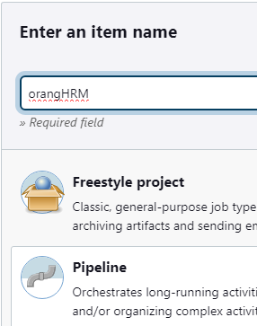
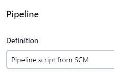
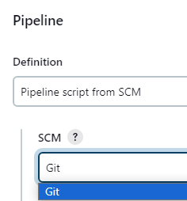
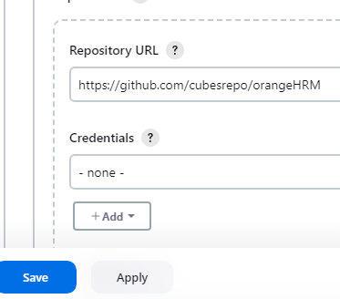
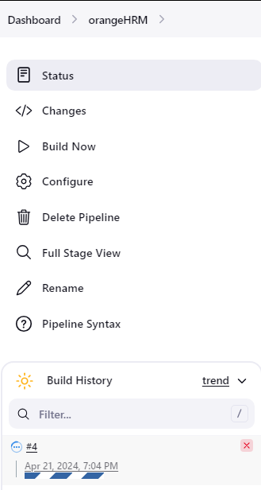

**Hello**🖐 **Automated Testing for orangeHRM Demo Website with Selenium (Pytest, POM, HTML Reports, Jenkins Pipeline)**

This project tests various functionalities of the OrangeHRM demo website, such as valid and invalid login attempts, creating recruitment, adding multiple employees, modifying existing records, searching for added employees, and deleting all records.
___________________________________________

🎯 **Pre-requisites:**
- Python 3
- Any browsers(Chrome, Firefox, Edge)
___________________________________________

▶ **Test Execution**

Run commands: 
1. Install Dependecies:

       pip install -r requirements.txt
2. Run the test with html report:

       pytest -v --html=report.html 
   or specifying browser

       pytest -v --browser=edge --html=report.html
    

**To run this on jenkins**
1. Add item name, click Pipeline and click OK

2. Scroll down and navigate to Pipeline then select "pipeline script from SCM"

3. Select Git

   
4. Paste the URL and click Apply and Save
   
5. Click build now
   
   

    
   
   
    
