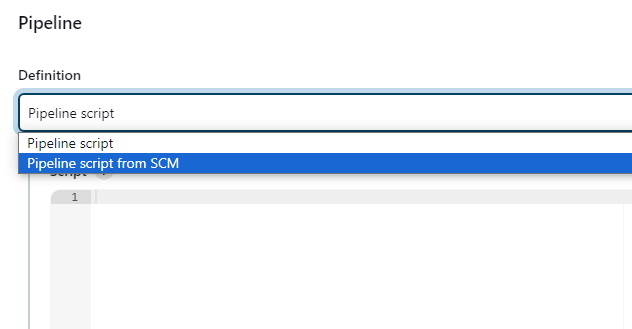
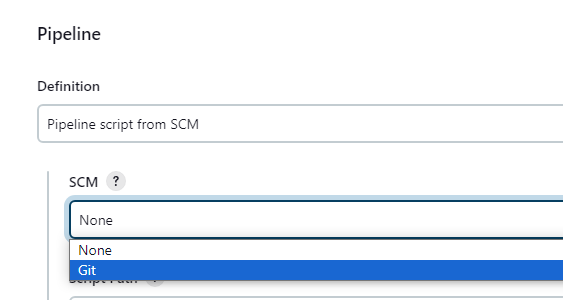

**Hello**🖐 **Automated Testing for OrangeHRM Website with (Selenium, Pytest, Page Object Model (POM), Allure Reports, Jenkins Pipeline)**

This project automates key workflows in the OrangeHRM web application, focusing on core HR functionalities such as employee and candidate management.

The main test scenarios cover user authentication and HR data handling, ensuring smooth and reliable functionality across different use cases.

Aside from the main flow, I also tested various edge cases to validate system stability and proper error handling. 
These include:
   - Valid and invalid login attempts 
   - Adding a user with an existing username 
   - Required field validation for mandatory inputs
___________________________________________

🎯 **Pre-requisites:**
- Python 3.11.9
- Any browsers(Chrome, Firefox, Edge)
___________________________________________

▶ **Test Execution**

Run commands: 
1. Install Dependecies:

       pip install -r requirements.txt
2. Run the test with Allure report:

       pytest -v --alluredir=reports/TestCase1
   or specifying browser

       pytest -v --browser=edge --alluredir=reports/TestCase1
    

**To run this on jenkins**
1. Add item name, click Pipeline and click OK
    
    
2. Scroll down and navigate to Pipeline then select "pipeline script from SCM"
    
   
3. Select Git
    
   
4. Paste the Repo URL and click Apply and Save
    
   
5. Click build now
    
   

    
   
   
    
